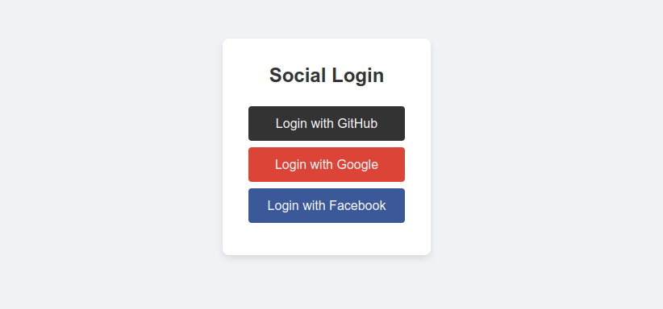

# Django Social Authentication

This project demonstrates how to integrate social authentication (Google, GitHub, and Facebook) into a Django application using the `social-auth-app-django` library.

#### Login Page 



## Features

- User authentication with Google, GitHub, and Facebook.
- Redirects authenticated users to a protected dashboard.
- Users can log out and be redirected to the login page.

## Usages
You System must have the following things to use this File Sharing App.
 - Installation of `python` and  `pip`

    Python is available for every platform. Download it according to you os. You can download it from [Here.](https://www.python.org/downloads/)


Follow the mentioned procedure to run this project in your local system.
 - Clone or Download the Repository
```bash
    git clone https://github.com/santoshvandari/SocialMediaAuthentication.git
    cd SocialMediaAuthentication
```
 - Create the Virtual Environment Before installing the requirements. 
 ```Bash
    python3 -m virtualenv venv #For Linux User
 ```
  - Activate the Virtual Environment
  ```bash
    source venv/bin/activate  #For Linux
     Note: It is not Necessary to Create Virtual Environment but recommanded.
  ``` 
 - Install the Requirements
```bash
    pip install -r requirements.txt
```
 - Register as a Developer in different platform to get Client-ID & Secret-Key. You can also Follow [Social Account Setup](SocialAccountSetup.md)

 - Configure OAuth Credentials
 ```bash
    Update a .env file in the root directory of the project and add your OAuth credentials:
    # Google OAuth2
    SOCIAL_AUTH_GOOGLE_OAUTH2_KEY=your-google-client-id
    SOCIAL_AUTH_GOOGLE_OAUTH2_SECRET=your-google-client-secret

    # GitHub OAuth2
    SOCIAL_AUTH_GITHUB_KEY=your-github-client-id
    SOCIAL_AUTH_GITHUB_SECRET=your-github-client-secret

    # Facebook OAuth2
    SOCIAL_AUTH_FACEBOOK_KEY=your-facebook-app-id
    SOCIAL_AUTH_FACEBOOK_SECRET=your-facebook-app-secret

    Note: You can also change the Auth Types according to your need. For that you just need to modify the setting.py file and Templates Files.
 ```
 - Make the Migrations and Migrate the Model
 ```bash
    # For making the Migrations
    python3 manage.py makemigrations
    # For Migrating the Model 
    python3 manage.py migrate
```
 - Run the Server
```bash
    python3 manage.py runserver #For Linux User
```
 - Open the url in Browser
 ```bash
    http://127.0.0.1:8000/  #For Home
    http://127.0.0.1:8000/login # For Login
 ```
 You can also consider the Docs of [social-auth-app-django](https://python-social-auth.readthedocs.io/en/latest/index.html) for more information.
## Contributing
We welcome contributions! If you'd like to contribute to this Social Media Authenticaton, please check out our [Contribution Guidelines](Contribution.md).

## Code of Conduct
Please review our [Code of Conduct](CodeOfConduct.md) before participating in this app.

## License
This project is licensed under the [License](LICENSE).
